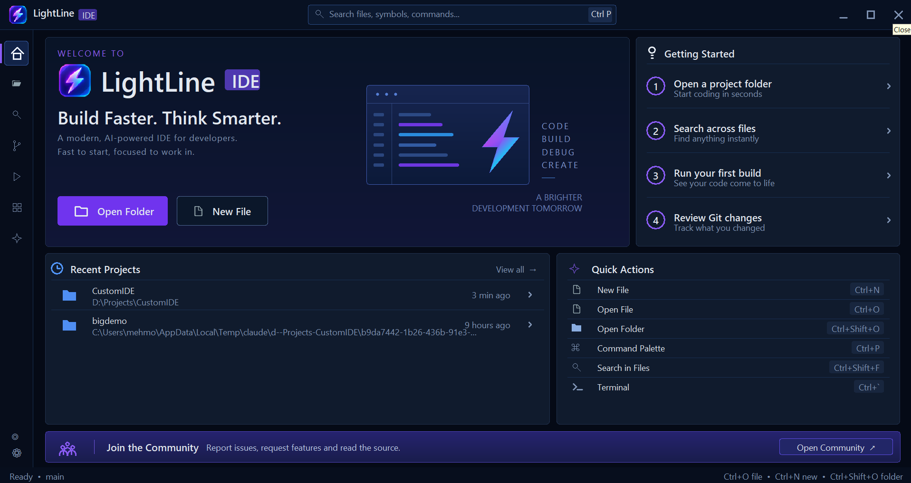

<div align="center">


# LightLine

**A lightning-fast, lightweight native Windows code editor written in Rust.**

[](https://github.com/mehmoodulhaq570/LightLine/actions/workflows/rust.yml)
[](https://github.com/mehmoodulhaq570/LightLine/releases/latest)
[](#requirements)
[](Cargo.toml)
[](LICENSE)

<br>



</div>

---

## Highlights

- ⚡ **Native Performance**: Built directly on Rust and Win32 GDI. Sub-20ms launch time, minimal memory consumption, zero Electron or web view overhead.
- 📦 **Zero-Dependency Portable Binary**: Single ~5.2 MB executable. Download and double-click — no installers, extra runtimes, or admin privileges needed.
- 🌲 **Tree-sitter Syntax Coloring**: High-speed, background-worker semantic highlighting for Rust and Python with smart incremental re-parsing.
- 🧠 **Integrated Language Support (LSP)**: Automatic background support for **rust-analyzer** and **Pyright** (self-installing): diagnostics, hover (`F1`), go-to-definition (`F12`), find references (`Shift+F12`), autocompletion (`Ctrl+Space`), and formatting (`Shift+Alt+F`).
- 🎨 **Built-in Formatters & Formatter Framework**: `.json` and `.toml` files format with no tools installed (`Shift+Alt+F` / `formatOnSave`). Both only change layout, so comments, key order and values are kept; JSONC files such as `tsconfig.json` work too. Web files format via a generic, timeout-protected `Formatter` interface with Prettier, with room for rustfmt/Black/clang-format next.
- 🌿 **Git Gutter & Code Folding**: For files in a Git repository, the gutter marks lines added (green), modified (blue) and deleted (red marker) compared with `HEAD`, updated as you type. Code folding collapses bracket (`{ }`, `[ ]`, `( )`) and indentation blocks from gutter chevrons (`⌄`/`›`) into a `...` pill; the arrow keys, scrolling and the caret all skip collapsed lines.
- 💻 **Multi-Session Terminal & Shell Picker**: Persistent ConPTY terminal with multiple tabs, full VT100/ANSI support, and interactive shell selection (**PowerShell**, **Command Prompt**, **Git Bash**, and **WSL**). Features a dedicated dropdown picker (`⌄`) and right-click menu to launch any installed shell or configure your default profile, with tabs clearly labeled by shell type (`PWSH`, `CMD`, `BASH`, `WSL`). Cleanly separated from the read-only build/run **Output** stream, which seamlessly takes keyboard input while your program runs.
- 🗂️ **Workspaces & Full Explorer Operations**: Quick Open (`Ctrl+P`), project-wide content search (`Ctrl+Shift+F`), and folder tree navigation with subtle hierarchy indentation guides and alphabetical sorting. Features a **built-in curated vector SVG icon suite** (Rust, Python, Markdown, JSON, TOML, Git, web formats, and two-tone folders) working 100% offline out-of-the-box. Full file/folder management: create files/folders (`+`, `+Folder`), inline creation and renaming, right-click context menu (`New File`, `New Folder`, `Reveal in File Explorer`, `Copy Path`, `Rename`, `Delete`), safe deletion with dark confirmation dialog, and workspace close/discard (`>Close Workspace`).
- 🏛️ **Unified Workbench & Welcome Dashboard**: A compact branded title bar, centered Quick Open command center, native window controls, and icon-only activity rail now carry consistently across the editor and Welcome screen. The responsive Welcome dashboard provides quick-start cards, recent projects, keyboard-driven actions, onboarding links, and community access without taking over the desktop.
- 🌿 **Source Control**: Stage, commit and discard from the sidebar (`Ctrl+Shift+G`). A focused commit composer, Push/Pull/Fetch controls, branch and sync status, polished clean-worktree state, collapsible Staged/Changes/History sections, timeline commit history, and side-by-side diff review keep the complete Git workflow inside LightLine.
- 🐞 **Interactive Debugger (Rust & Python)**: Built-in Debug Adapter Protocol (DAP) client for **Rust: Current Workspace** (built with Cargo, debugged with `lldb-dap`) and **Python: Current File** (debugged with `debugpy`). The configuration follows the active file, or can be pinned from the Run & Debug dropdown. It provides `F5` start/continue, gutter or `F9` breakpoints, Pause/Continue, Step Over/In/Out, Restart, Stop, expandable variable trees, call-stack inspection, breakpoint counts, and collapsible Variables/Call Stack/Breakpoints sections. Python programs run in the Output pane, so `input()` works while debugging, and an uncaught exception pauses where it was raised. Session controls appear only while a real debug session exists.
- 🤖 **Local AI Assistant (optional)**: Ask about the selected code and get answers as they're written, from a model on your own PC through Ollama. Off until you connect it; nothing runs in the background or leaves your machine. See [AI Assistant](#ai-assistant-optional).
- ▶️ **Multi-Language File Runner**: `Ctrl+Shift+R` runs the active Python, C/C++, or Rust file and streams its output into the Output pane. C/C++ files can be run but not yet debugged.
- 🧩 **Real Zed Extensions & Icon Themes**: The redesigned Extensions panel (`Ctrl+Shift+X`) provides Marketplace/Installed tabs, live search, Featured/Themes/Formatters filters for the curated extensions, cards showing each extension's publisher, registry version and kind, and an Active Capabilities summary of the formatter and icon theme actually in use. It installs actual extensions from the live [Zed registry](https://github.com/zed-industries/extensions); installing a Zed **color theme** (e.g. Dracula) or the 1,000+ icon **Material Icon Theme** updates the editor immediately, with automatic fallback to the built-in vector icons when themes are removed.
- ⚙️ **User Configuration**: a **Settings** panel (the gear at the bottom of the left rail, or `Ctrl+,`) for font size, indentation, word wrap, brackets, format-on-save, color theme and the default shell, all applied as you change them, backed by `%APPDATA%\LightLine\settings.json`.
- 💾 **Session Restore**: Automatically reopens your last workspace, tabs, cursor positions, and scroll offsets on launch.

---

## Download & Quick Start

### Portable Binary (Recommended)
Grab the latest build from **[GitHub Releases](https://github.com/mehmoodulhaq570/LightLine/releases/latest)**:
- **[`lightline.exe`](https://github.com/mehmoodulhaq570/LightLine/releases/latest)**: Direct standalone executable.
- **[`lightline-v<version>-windows-x86_64.zip`](https://github.com/mehmoodulhaq570/LightLine/releases/latest)**: Archive bundling the executable, README, and CHANGELOG.
- **[`SHA256SUMS.txt`](https://github.com/mehmoodulhaq570/LightLine/releases/latest/download/SHA256SUMS.txt)**: SHA-256 checksums for both release downloads.

#### Windows SmartScreen notice

LightLine is currently distributed as an unsigned Windows application. When opening it for the first time, Microsoft Defender SmartScreen may display **“Windows protected your PC”** and identify the publisher as unknown. If you downloaded LightLine from the official GitHub release and verified its checksum, click **More info**, confirm that the listed app is `lightline.exe`, and then click **Run anyway**. Do not disable SmartScreen, and do not continue if Windows reports a malware detection rather than an unrecognized app warning.

#### Verify the download

Every release includes `SHA256SUMS.txt`. In PowerShell, calculate the downloaded file's SHA-256 value:

```powershell
Get-FileHash .\lightline.exe -Algorithm SHA256
```

Compare the displayed hash with the `lightline.exe` entry in `SHA256SUMS.txt`. They must match exactly. For the ZIP download, run the same command with the ZIP filename and compare it with the corresponding ZIP entry. Delete the download if the values differ.

### Build from Source
Ensure you have the Rust toolchain installed on Windows 10/11:
```powershell
git clone https://github.com/mehmoodulhaq570/LightLine.git
cd LightLine
cargo run --release
```

---

## Keyboard Shortcuts

| Shortcut | Action |
| --- | --- |
| `Ctrl+P` | **Quick Open** files; type `>` for Command Palette |
| `Ctrl+,` | **Open Settings** (run `>Open Settings (JSON)` to edit `settings.json` directly) |
| `Ctrl+N` / `Ctrl+W` | New tab / Close active tab |
| `Ctrl+O` / `Ctrl+S` | Open file / Save active file |
| `Ctrl+Shift+O` | Open Folder (Workspace) |
| `Ctrl+\` | Split editor vertically / Unsplit |
| `Ctrl+1` / `Ctrl+2` | Focus left or right split pane |
| `Ctrl+B` | Toggle sidebar (Explorer, Search, Git, Debug, Extensions) |
| `Ctrl+Shift+D` | Toggle **Run & Debug** panel |
| `Ctrl+Shift+X` | Toggle **Extensions** panel |
| `Ctrl+F` | Find in current file: a find box opens at the top right and shows the match count; `Enter` / `Shift+Enter` (or `F3` / `Shift+F3`) next / previous, `Esc` closes |
| `Ctrl+H` | Find and replace in current file: `Tab` switches fields, `Enter` replaces the current match, `Alt+Enter` replaces all (one `Ctrl+Z` undoes it) |
| `Ctrl+Shift+F` | Search across workspace files; press `Enter` to move focus to the results |
| `Up` / `Down` / `Enter` / `Esc` | In search results: move selection, open the selected match, or leave search |
| `Ctrl+Shift+G` | **Source Control**: stage, commit, diff review |
| `↑` / `↓` / `Enter` / `Space` | In the source control list: move, open diff, stage or unstage |
| `F5` / `Shift+F5` | Debug (Rust or Python): Start & Continue / Stop session |
| `F10` | Debug: Step Over |
| `F11` / `Shift+F11` | Debug: Step Into / Step Out |
| `F9` / Gutter Margin Click | Toggle line breakpoint (red gutter dot) |
| Gutter Chevron Click | Toggle code folding (`⌄` / `›`) |
| `Ctrl+Shift+R` | Run the active file (Python, C/C++, or Rust — detected automatically) |
| `Ctrl+Shift+B` | Run Rust tests (`cargo test`) |
| `Ctrl+Shift+W` | Close the active workspace and return to the Welcome screen |
| `Ctrl+\`` | Toggle terminal panel |
| `Ctrl+Shift+\`` | Open a new terminal tab |
| `F1` | Show hover documentation at cursor |
| `F12` | Go to symbol definition |
| `Shift+F12` | Find all references to the symbol at cursor |
| `Ctrl+Space` | Trigger autocompletion popup |
| `Shift+Alt+F` | Format active document (Native JSON/TOML, Prettier, or active language server) |
| `Alt+Z` | Toggle word wrap for the current file (on by default for Markdown) |
| `Ctrl+Shift+V` | Markdown preview of the active `.md` file (`>Markdown: Open Preview to the Side` shows it beside the file) |
| `F2` | In Explorer: Rename selected file or folder |
| `Delete` | In Explorer: Delete selected file or folder (with confirmation) |
| `>Close Workspace` | Command Palette: Close active workspace and return to Welcome screen |
| `Ctrl++` / `Ctrl+-` / `Ctrl+0` | Zoom UI in / out / reset to 100% |

Keyboard focus follows the active surface. Search results and other sidebar lists keep navigation and deletion keys away from the hidden editor, while global commands such as Extensions (`Ctrl+Shift+X`) and debugger controls (`F5`, `F10`, `F11`) remain available. Opening or closing a workspace, opening a search result, or pressing `Esc` clears stale sidebar/search focus. When a running program owns the Output pane, `Enter` and modified `Backspace` are encoded correctly for its standard input.

---

## User Settings

Click the **gear** at the bottom of the left rail (or press **`Ctrl+,`**) to open **Settings** in the side panel. Changes apply at once and are saved to `%APPDATA%\LightLine\settings.json`; anything else in that file, such as `colors`, is kept.

To edit the file directly, click **Open settings.json** at the bottom of the panel or run **`>Open Settings (JSON)`** from `Ctrl+P`; saving it applies it. Any field you omit keeps its default:

```json
{
  "fontFamily": "Consolas",
  "fontSize": 14,
  "tabSize": 4,
  "insertSpaces": true,
  "wordWrap": false,
  "autoClosePairs": true,
  "autoIndent": true,
  "formatOnSave": false,
  "bracketMatching": true,
  "indentGuides": true,
  "markdownLoadRemoteImages": false,
  "colorTheme": "Dracula",
  "aiEndpoint": "http://localhost:11434",
  "aiModel": "qwen2.5-coder:7b",
  "colors": {
    "editorBg": "#141820",
    "text": "#d8dee9",
    "selectBg": "#264f78",
    "keyword": "#4a90e2",
    "string": "#a3be8c",
    "comment": "#6b7280"
  }
}
```

`fontSize` (8–48) sets the code font's size and `fontFamily` its font, when that font is installed. `bracketMatching` and `indentGuides` turn those highlights on or off. `minimap`, `smoothScrolling` and `parseLimitKb` are accepted but don't do anything yet. `tabSize`, `insertSpaces`, and `autoIndent` drive real editor behavior (indentation on Enter, tab-width rendering, the status bar's "Spaces: N" indicator) — they're not just stored. `formatOnSave` runs the active formatter (built-in for JSON/TOML, Prettier for web files) before every save. `colorTheme` names the installed color theme to use (a variant name such as `"Catppuccin Mocha"`; leave it out for LightLine's own theme) — **Preferences: Color Theme** in the command palette picks one and writes it here. `colors` overrides any of LightLine's core theme fields by name, on top of the color theme — the same fields a Zed color-theme extension maps onto (see below).

---

## Language & Debugger Requirements

- **Rust**: For language intelligence, install components with:
  ```powershell
  rustup component add rust-analyzer rust-src
  ```
- **Rust debugger (LLDB)**: For native Rust debugging via DAP (`F5`), ensure `lldb-dap` (bundled with LLVM or Visual Studio C++ Build Tools) is present on your system `PATH`.
- **Python debugger (debugpy)**: Python debugging uses the same interpreter as `Ctrl+Shift+R` (the selected one, a nearby `.venv`, or `python` on `PATH`), which needs `debugpy`: `python -m pip install debugpy`, or run **Python: Install debugpy** from the command palette. C/C++ files can be run but not yet debugged.
- **Python**: For Python diagnostics and hover, install Node.js once (e.g. `winget install OpenJS.NodeJS.LTS`). LightLine automatically downloads and manages Pyright into `%APPDATA%\LightLine\pyright`. Run Python files with `Ctrl+Shift+R`, or debug them with `F5`.
- **Prettier** (JS/TS/JSON/CSS/HTML/Markdown/YAML formatting): install `prettier` globally (`npm install -g prettier`) or have it available via `npx`. LightLine only detects it — it never installs or modifies anything outside its own extensions folder on your behalf.

---

## AI Assistant (optional)

The AI Assistant (the sparkle in the activity rail) chats about your code with a model that runs **on your own PC** through [Ollama](https://ollama.com): free, private, and it works offline. It is off until you connect it. LightLine starts no AI process, downloads nothing and sends nothing on its own.

1. Install Ollama from [ollama.com](https://ollama.com) and download a model, e.g. `ollama pull qwen2.5-coder:7b` (smaller PCs: `qwen2.5-coder:1.5b`).
2. Open the AI Assistant and click **Connect to Ollama**. LightLine asks Ollama which models it has and picks a chat model made for code, never a cloud one.
3. Type a question and press **Enter** (**Shift+Enter** for a new line). If code is selected in the editor, it is sent along; the panel shows which lines ("Includes app.rs, lines 40–82") before you send.

Answers appear as they're written and are shown as Markdown, with Rust and Python code in the editor's colors. **Esc** (or the square button) stops an answer, **+** starts a new chat, and the model name in the header switches models, refreshes the list or turns the assistant off.

Each code block in an answer has three buttons:

- **Insert** puts the code at the editor's cursor.
- **Replace** puts it in place of the code the question was about (or of the current selection), as long as that file hasn't changed since.
- **Copy** copies it.

Inserted and replaced code takes the indentation of where it lands, so a block the model wrote at column 0 fits inside an indented function. Either one is a single step for **Ctrl+Z**.

**From the editor:** right-click selected code for **AI: Explain / Fix / Write Tests for / Add Comments to Selection**. Right-click a red or yellow underline for **AI: Explain This Error** or **AI: Fix This Error**. The fix selects the lines it will rewrite, staying inside the error's block, so **Replace** puts the corrected code right back. The same actions are in the command palette (`Ctrl+P`, then `>AI:`). The right-click menu also has Cut, Copy, Paste and Select All.

- **Other servers**: set `aiEndpoint` in `settings.json` to any OpenAI-compatible server, e.g. LM Studio (`http://localhost:1234`) or llama.cpp's server.
- **Ollama's cloud models** (names ending in `cloud`, such as `gpt-oss:120b-cloud`) run on ollama.com, not on your PC. LightLine never picks one for you; if you choose one, the panel says your questions and code go to ollama.com.

---

## Extensions

The Extensions panel (`Ctrl+Shift+X`) installs real extensions from the live [Zed extension registry](https://github.com/zed-industries/extensions) — LightLine is not building its own marketplace; it reads Zed's. Search any extension by name or ID and click Install; it's cloned via `git` into `%APPDATA%\LightLine\extensions\<id>`.

Two extension types are supported today, both pure data (no extension code runs inside LightLine):

- **Icon themes** — map file/folder names to SVG icons. **Material Icon Theme** can be installed from the Extensions panel; until an icon theme is installed, LightLine uses its built-in vector icons.
- **Color themes** — recolor all of LightLine, not just the editor: sidebar, tabs, buttons, menus, dialogs, the Extensions panel and the terminal's colors, in dark and light themes alike. Installing one (e.g. **Dracula**) switches to it immediately, with no restart, and the choice is remembered across restarts. A theme that ships several variants (Catppuccin's Latte, Frappé, Macchiato and Mocha) offers each one in **Preferences: Color Theme**, also reachable from the Color Theme row under Active Capabilities in the Extensions panel. Colors a theme doesn't define are derived from its own palette, so they still match. Uninstalling it reverts to LightLine's own theme.

Any other extension type (language servers, procedural/WASM extensions) is reported as not supported yet rather than silently half-installed.

The Welcome and workbench redesign does not replace or bypass this extension system. The activity rail's Extensions action still opens the same live, searchable Zed registry and retains the existing install, uninstall, icon-theme, and color-theme behavior.

---

## Code Signing Policy

Free code signing provided by [SignPath.io](https://signpath.io), certificate by [SignPath Foundation](https://signpath.org).

Release builds of `lightline.exe` are built from this repository by the GitHub Actions [release workflow](.github/workflows/release.yml) and submitted for signing from there. Only binaries built from this repository's source are signed.

**Team roles**

| Role | Member |
| --- | --- |
| Author (trusted to modify code) | [Mehmood-Ul-Haq](https://github.com/mehmoodulhaq570) |
| Reviewer (reviews external contributions) | [Mehmood-Ul-Haq](https://github.com/mehmoodulhaq570) |
| Approver (approves release signing) | [Mehmood-Ul-Haq](https://github.com/mehmoodulhaq570) |

**Privacy policy**

LightLine does not collect or send usage data. It uses the network only for these features: searching and installing extensions (reads the public Zed extension registry and clones the extension's git repository); **Push**, **Pull** and **Fetch** in Source Control, which run `git` against your repository's own remote; **Python: Install debugpy**, which runs `pip install debugpy` from PyPI in the Output tab; web images in a Markdown preview, only after you click **Load images** for that workspace (or turn on `markdownLoadRemoteImages`), cached in `%APPDATA%\LightLine\cache\images`; and a one-time Pyright setup: the first time you open a Python file with Node.js and npm installed and no Pyright found, LightLine downloads Pyright from npm into `%APPDATA%\LightLine\pyright`. LightLine writes only inside its own folder at `%APPDATA%\LightLine` plus the files and folders you open, create, or edit; the one exception is **Python: Install debugpy**, which installs `debugpy` into your selected Python environment. LightLine can be removed by deleting `lightline.exe` and, optionally, the `%APPDATA%\LightLine` folder.

---

## Project Documentation & Contributing

- [Architecture & System Map](ARCHITECTURE.md)
- [Contributing Guide](CONTRIBUTING.md)
- [Code of Conduct](CODE_OF_CONDUCT.md)
- [Version Changelog](CHANGELOG.md)
- [Reference Visual Adaptation](design/REFERENCE_ADAPTATION.md)
